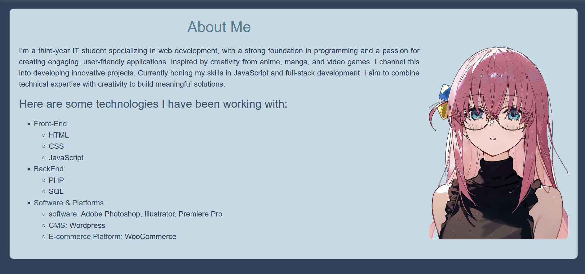
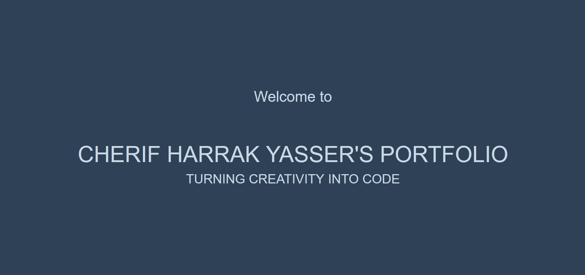

# Personal Portfolio

This is my personal portfolio project, showcasing my skills, projects, and background as a web developer. It was built as the final project for the Codedex CSS course.

## 🖥️ Preview



---

## 📖 About the Project
The portfolio highlights:
- **Introduction**: Welcoming visitors with a professional tagline.
- **About Me**: A summary of my background, interests, and technologies I've worked with.
- **Skills & Tools**: A list of front-end, back-end, and software proficiencies.

### Features:
- Responsive Design: Optimized for different screen sizes.
- Sleek and Minimalist UI: Built with a modern design approach.
- Clear Information Structure: Easy-to-navigate layout for quick access.

## 💻 Built With:
- **HTML5** for content structure.
- **CSS3** for styling and layout.
- **GitHub Pages** for hosting the live demo.

## 🚀 Future Enhancements:
- Update the color palette for better aesthetics.
- Add sections for live project links and testimonials.
- Include animations for interactivity.

## 📸 Screenshots
### Welcome Section:


### About Me Section:


## 🔗 Live Demo
[Check out the live site](https://your-live-portfolio-link.com)

## 📂 Project Setup
To run the project locally:
1. Clone this repository:
   ```bash
   git clone https://github.com/Harrakyass/personal-portfolio.git

2. Open index.html in your browser.

🙌 Acknowledgements

This project was created as part of the Codedex CSS course.